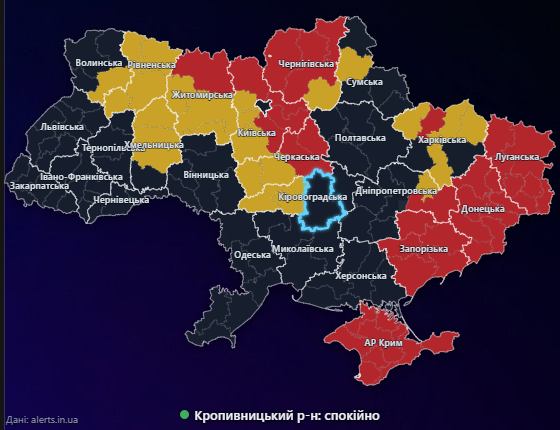

# Карта тривог — віджет для робочого столу Windows

Прозора карта повітряних тривог України, яка «живе» прямо на робочому столі.
Дані — з публічного API [alerts.in.ua](https://alerts.in.ua).



## Можливості

- Карта областей і 136 районів з прозорим фоном: червоний / жовтий рівень тривоги.
- Підказка при наведенні: з якого часу тривога, типи загроз (БпЛА, ракети, КАБи…), громади під тривогою.
- **Мої райони**: оберіть райони чекбоксами — обвідка на карті, статус під картою і плашка **поверх усіх вікон** при тривозі та відбої (зі звуком за бажанням).
- Два режими розміщення:
  - *над ярликами* — нижній шар, не ховається по Win+D, можна перетягувати й розтягувати;
  - *під ярликами* — як живі шпалери (для переміщення є «Режим редагування» в треї).
- Автозапуск з Windows, закріплення положення, прозорість, іконка в треї з кольором статусу.

## Встановлення

1. Отримайте власний токен API: <https://devs.alerts.in.ua> (заповніть форму й обов’язково дайте відповідь на лист, щоб токен активувався).
2. Завантажте інсталятор з [Releases](../../releases) або зберіть самостійно (див. нижче).
3. Під час першого запуску відкриються налаштування — вставте токен і позначте свої райони.

Налаштування зберігаються в `%APPDATA%\trevoga-map\settings.json`.

## Збірка з вихідного коду

Потрібен Node.js 20+.

```bash
npm install
npm start            # запуск віджета
npm run dist         # інсталятор dist/trevoga-map-setup-<version>.exe
```

Без інсталятора: `scripts\install.bat` встановить залежності, додасть автозапуск (`scripts\start-widget.vbs`) і запустить віджет.
`scripts\autostart-on.bat` / `autostart-off.bat` вмикають і вимикають автозапуск.

### Вбудований токен (необов’язково)

Якщо покласти токен у `build/token.txt` (або змінну `ALERTS_TOKEN`), `npm run dist` вбудує його в інсталятор як токен за замовчуванням.
Робіть це лише для особистих збірок: [правила API](https://devs.alerts.in.ua) забороняють вшивати токен у застосунки, які отримують інші користувачі.
`build/token.txt` і `app/embedded.json` виключені з git.

### Карта

`app/assets/map.json` згенеровано скриптом `build/make-map.js` з адміністративних меж [OCHA / HDX COD-AB Ukraine](https://data.humdata.org/dataset/cod-ab-ukr).
Відповідність районів ідентифікаторам API (`location_uid`) — у `build/raion-uids.json`.

```bash
node build/make-map.js path/to/ukr_admin2.geojson
```

## Як це працює

- Кожні 15 с — `/v1/iot/active_air_raid_alerts.json` (статус усіх областей і районів), кожні 30 с — `/v1/alerts/active.json` (деталі для підказок). Разом 6 запитів/хв при ліміті 8–10; використовується `If-Modified-Since`.
- Electron: прозоре вікно без рамки; прив’язка до робочого столу через Win32 (`koffi`).

## Відмова від відповідальності

Віджет — неофіційний і має лише інформаційний характер. Дані можуть надходити із затримкою.
**Не покладайтеся на нього як на єдине джерело оповіщення** — користуйтеся офіційними застосунками («Повітряна тривога», «Дія») та сиренами.

## Ліцензії та атрибуція

- Код — [MIT](LICENSE).
- Дані про тривоги — [alerts.in.ua](https://alerts.in.ua), за [умовами використання](https://alerts.in.ua/terms-of-usage) (атрибуція показана на віджеті).
- Межі адміністративних одиниць — OCHA / HDX, State Scientific Production Enterprise "Kartographia", [CC BY-IGO](https://creativecommons.org/licenses/by/3.0/igo/).
